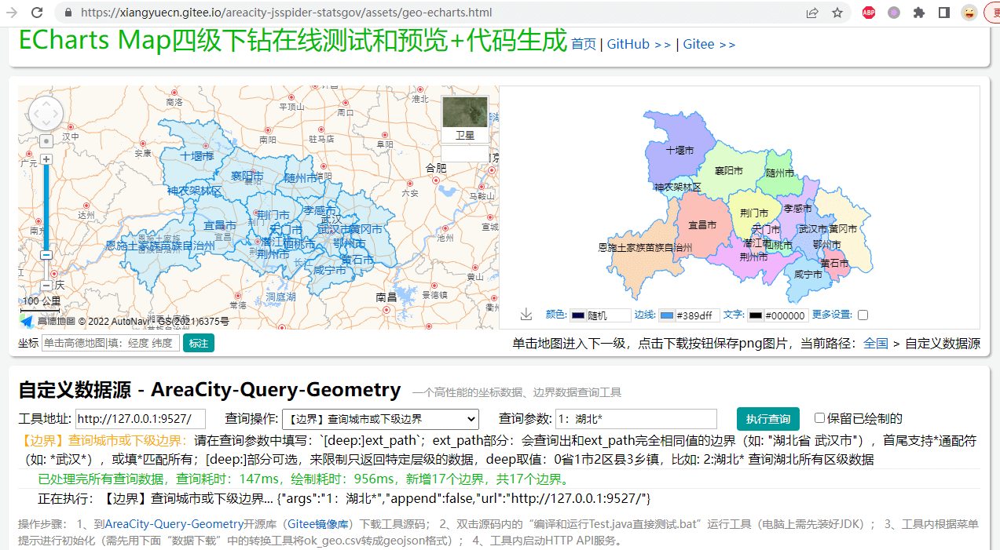
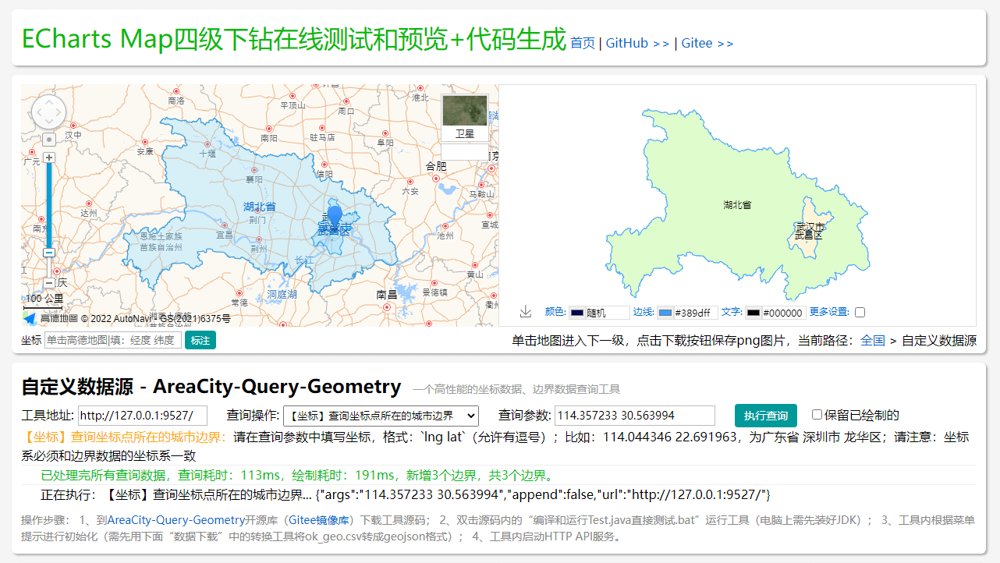
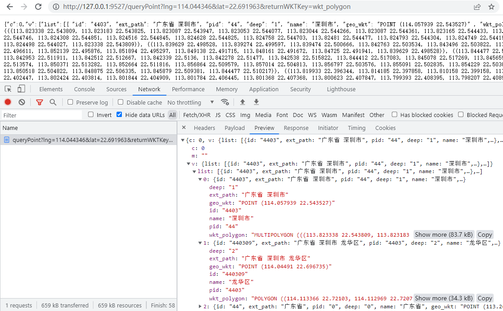
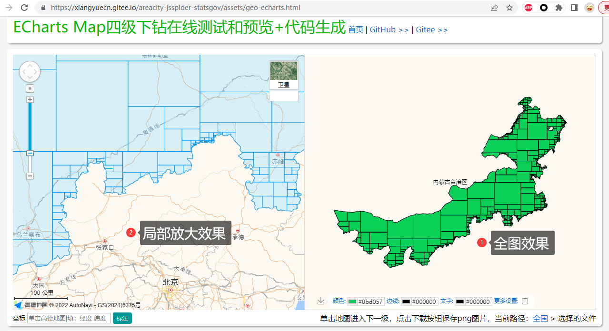

**【[源GitHub仓库](https://github.com/xiangyuecn/AreaCity-Query-Geometry)】 | 【[Gitee镜像库](https://gitee.com/xiangyuecn/AreaCity-Query-Geometry)】如果本文档图片没有显示，请手动切换到Gitee镜像库阅读文档。**

# :open_book:AreaCity-Query-Geometry坐标边界查询工具

**本工具核心功能：使用`jts库`从`省市区县乡镇边界数据`（[AreaCity-JsSpider-StatsGov开源库](https://github.com/xiangyuecn/AreaCity-JsSpider-StatsGov)）或`geojson边界数据`文件中查找出和任意点、线、面有相交的矢量边界，内存占用低，性能优良（1秒可查1万个以上坐标对应的城市信息）。**

- 查询一个坐标点对应的城市信息；
- 查询一条路径经过的所有城市；
- 查询一个矢量范围覆盖的所有城市；
- 查询一个城市或下一级所有边界数据（WKT格式）；
- 支持通过HTTP API服务进行查询调用；
- 支持通过Java代码进行查询调用；
- 源码简单，包括测试bat脚本共5个文件，无需IDE即可修改和运行，copy即用。


[​](?)

你可以只copy `AreaCityQuery.java` 文件到你的项目中使用（建好package目录或者修改一下package），项目中引入`jts库`，就能使用 `AreaCityQuery` 中的所有查找功能了。也可以clone整个项目代码双击 `编译和运行Test.java直接测试.bat` 即可直接运行测试（Mac需自己用javac进行编译运行）。

**API和图形界面**：本工具已自带了一个HTTP API服务，运行测试然后通过菜单启动此服务，然后就可以直接在浏览器上访问这些接口；此API接口可以直接在 [ECharts Map四级下钻在线测试和预览](https://xiangyuecn.gitee.io/areacity-jsspider-statsgov/assets/geo-echarts.html) 页面的`自定义数据源`中进行调用测试，页面会立即绘制查询出来的边界图形。

[​](?)

源文件|是否必须|说明
:-:|:-:|:-
**AreaCityQuery.java**|必须|核心功能类，封装了所有核心功能，支持从`geojson`文件初始化。
**jts-core-1.18.2.jar**|必须|唯一依赖的jts库，从[maven此链接](https://mvnrepository.com/artifact/org.locationtech.jts/jts-core/1.18.2)下载来的；<br>如需在pom.xml中引入，请参考maven链接页面内xml代码。
Test_HttpApiServer.java|可选|测试用的HTTP API服务实现（可以删除此文件，不影响Test.java运行）。
Test.java|可选|测试控制台程序，包含了所有功能的测试，包括启动HTTP API服务；<br>双击 `编译和运行Test.java直接测试.bat` 即可直接编译和运行此控制台程序（需装了jdk）。


**如需功能定制，网站、App、小程序开发等需求，请加下面的QQ群，联系群主（即作者），谢谢~**


[​](?)

[​](?)

## 【QQ群】交流与支持

欢迎加QQ群：484560085，纯小写口令：`areacity`


[​](?)

[​](?)

[​](?)

[​](?)

## 如何使用

### 前期准备：生成GeoJSON文件
程序初始化时，需要提供一个geojson文件（.json|.geojson），如果你没有此文件，可以按以下步骤获得最新的全国省市区县乡镇边界数据json文件：
1. 请到开源库下载省市区边界数据ok_geo.csv文件: https://github.com/xiangyuecn/AreaCity-JsSpider-StatsGov （github可换成gitee）；
2. 下载开源库里面的“AreaCity-Geo格式转换工具软件”；
3. 打开转换工具软件，选择ok_geo.csv，然后导出成geojson文件即可（默认会导出全国的省级数据，通过填写不同城市名前缀可以导出不同城市）。

> 如果你有多个小的geojson文件，需要合并成一个才行，可以通过上面下载的 `AreaCity-Geo格式转换工具软件` 中的 `高级功能`-`GeoJSON多个文件合并成一个文件` 来合并。

> 通过ok_geo.csv生成的geojson文件的坐标系默认是`GCJ-02`火星坐标系，查询时所有输入坐标参数的坐标系必须也是`GCJ-02`，否则坐标可能会有比较大的偏移，导致查询结果不正确；可以在转换工具的高级功能中使用坐标系转换，比如转成`WGS-84`GPS坐标系，重新导出geojson文件，这样查询时就能准确的查询GPS坐标了。

> 源码内已提供了一个 `仅供测试-全国省级GeoJSON数据-大幅简化粗略版.json` 文件（为了大幅减小文件体积，已严重精简过了，不可在其它地方使用），可以直接使用此文件测试，但只能测试到省级边界，如需正式测试或使用，请参考上面方法自行生成geojson文件。


[​](?)

### 使用方式一：通过HTTP API服务使用
操作步骤：
1. 双击 `编译和运行Test.java直接测试.bat` 运行测试控制台程序；
2. 根据控制台菜单命令进行初始化（需先把一个geojson文件放本程序目录内，否则要输入路径）；
3. 进入9号菜单，启动本地轻量HTTP API服务（编辑 Test.java 文件内的`HttpApiServerPort`可修改端口）；
4. 浏览器访问：`http://127.0.0.1:9527/` 查看接口文档；
5. 在需要的地方直接调用http地址接口，得到json响应结果；
6. 如需外网访问，可以直接暴露端口，或使用Nginx之类的反代此http端口（通过Nginx提供https访问）。

此HTTP API接口可以直接在 [ECharts Map四级下钻在线测试和预览](https://xiangyuecn.gitee.io/areacity-jsspider-statsgov/assets/geo-echarts.html) 页面的`自定义数据源`中进行调用测试，页面会立即绘制查询出来的边界图形。


[​](?)

### 使用方式二：Java直接调用
``` java
//先初始化，全局只会初始化一次，每次查询前都调用即可（查询会在初始化完成后进行），两种初始化方式根据自己业务情况二选一
//首次初始化会从.json或.geojson文件中读取边界图形数据，速度比较慢，会自动生成.wkbs结尾的结构化文件，下次初始化就很快了
AreaCityQuery.Init_StoreInWkbsFile("geojson文件路径", "geojson文件路径.wkbs", true);
//AreaCityQuery.Init_StoreInMemory("geojson文件路径", "geojson文件路径.wkbs", true);

//AreaCityQuery.OnInitProgress=(initInfo)->{ ... } //初始化过程中的回调，可以绑定一个函数，接收初始化进度信息

//注意：以下查询中所有坐标参数的坐标系必须和初始化时使用的geojson数据的坐标系一致，否则坐标可能会有比较大的偏移，导致查询结果不正确
//查询包含一个坐标点的所有边界图形的属性数据，可通过res参数让查询额外返回wkt格式边界数据
QueryResult res1=AreaCityQuery.QueryPoint(114.044346, 22.691963, null, null);

//查询和一个图形（点、线、面）有交点的所有边界图形的属性数据，可通过res参数让查询额外返回wkt格式边界数据
Geometry geom=new WKTReader(AreaCityQuery.Factory).read("LINESTRING(114.233963 30.546038, 114.468109 30.544264)");
QueryResult res2=AreaCityQuery.QueryGeometry(geom, null, null);

//读取省市区的边界数据wkt格式，这个例子会筛选出武汉市所有区县
QueryResult res3=AreaCityQuery.ReadWKT_FromWkbsFile("wkt_polygon", null, (prop)->{return prop.contains("武汉市 ");}, null);


System.out.println(res1+"\n"+res2+"\n"+res3);
//****更多的实例，请阅读 Test.java****
//****更多功能方法，请阅读 AreaCityQuery.java 源码****
```

[​](?)

### 附：.wkbs文件说明
初始化时如果提供了`saveWkbsFilePath`参数（为.wkbs结构化文件的路径）：
- 如果此文件已存在，将自动从此文件进行初始化，初始化速度会很快（文件只读不写）；
- 如果此文件不存在，将从.json或.geojson文件中读取边界图形数据，并生成此文件，速度比较慢（文件读写）。

因此可以先在本地用json文件进行初始化，自动生成一个wkbs文件，然后copy wkbs文件到别的地方使用（比如服务器、只读环境中）。


[​](?)

[​](?)

[​](?)

[​](?)

## 性能测试

> 测试数据源：AreaCity-JsSpider-StatsGov开源库[2021.220321.220428版本](https://github.com/xiangyuecn/AreaCity-JsSpider-StatsGov/releases/tag/2021.220321.220428)下载的ok_geo.csv文件按省市区导出成不同的geojson文件。
> 
> 测试采用开启多线程进行随机坐标点的查询（Test.java控制台5号菜单），测试机器配置：8核 2.20GHz CPU，SSD 硬盘。


[​](?)

### 测试一：Init_StoreInWkbsFile 内存占用很低（性能受IO限制）
数据源|文件大小|数据量|内存占用|7核QPS|单核QPS|单次查询耗时
:-:|-:|-:|-:|-:|-:|-:
省市区三级|176MB|3632条|41MB|6212|887|1.13ms
仅区级|107MB|3208条|24MB|13818|1974|0.51ms
仅省级|20MB|34条|4MB|19832|2833|0.35ms

> `Init_StoreInWkbsFile`：用加载数据到结构化数据文件的模式进行初始化，推荐使用本方法初始化，边界图形数据存入结构化数据文件中，内存占用很低，查询时会反复读取文件对应内容，查询性能消耗主要在IO上，IO性能极高问题不大。


[​](?)

### 测试二：Init_StoreInMemory 内存占用和json文件差不多大（性能豪放）
数据源|文件大小|数据量|内存占用|7核QPS|单核QPS|单次查询耗时
:-:|-:|-:|-:|-:|-:|-:
省市区三级|176MB|3632条|161MB|77242|11034|0.091ms
仅区级|107MB|3208条|96MB|121228|17318|0.058ms
仅省级|20MB|34条|18MB|465940|66562|0.015ms

> `Init_StoreInMemory`：用加载数据到内存的模式进行初始化，边界图形数据存入内存中，内存占用和json数据文件大小差不多大，查询性能极高；另外可通过设置 `AreaCityQuery.SetInitStoreInMemoryUseObject=true` 来进一步提升性能，但内存占用会增大一倍多，省市区三级单核可达到 15000 QPS。


[​](?)

### 参考：数据库查询测试对比
数据源|数据量|查询坐标|MySQL单次查询耗时|SQL Server单次查询耗时
:-:|-:|:-:|-:|-:
省市区三级|3632条|深圳-龙华区|163ms|25ms
省市区三级|3632条|北京-房山区|173ms|47ms

``` sql
-- 查询坐标点：`POINT(114.044346 22.691963)` 深圳市 龙华区；`POINT(116.055588 39.709385)` 北京市 房山区（查询受内蒙envelope干扰影响性能）；

-- MySQL（8.0.19）使用MyISAM引擎并给polygon创建polygon_envelope列当做索引加速
create procedure ptest() begin declare i int default 0; while i<100 do do (select count(*) from (select id,ext_path from 【表名】 where ST_Intersects(polygon_envelope,ST_GeomFromText('POINT(114.044346 22.691963)',0))=1 and ST_Intersects(polygon,ST_GeomFromText('POINT(114.044346 22.691963)',0))=1) as t); set i=i+1; end while; end; call ptest(); drop procedure if exists ptest;

-- SQL Server（2008）在polygon列创建空间索引加速
declare @t datetime = getdate(); declare @val varchar; declare @i int =0; while @i<100 begin; set @val=(select id,ext_path from 【表名】 where polygon.STIntersects(geometry::STGeomFromText('POINT(114.044346 22.691963)',0))=1 for xml path('')); set @i=@i+1; end; select DATEDIFF(MS, @t, GETDATE())/100.0
```


[​](?)

[​](?)

[​](?)

[​](?)

[​](?)

[​](?)


# :open_book:图例

控制台运行：


HTTP API图形界面-边界查询：



HTTP API图形界面-坐标查询：



HTTP API调用查询：




[​](?)

[​](?)

[​](?)

# :open_book:知识库

本工具的代码 *.java 文件全部被丢到根目录，没有创建包名目录，源码直接根目录裸奔，简单粗暴；这样的项目结构肉眼看去也算是简洁，也方便copy文件使用。

编写本查询工具代码的原因是数据库查询坐标点对应的城市速度太慢了，影响数据库运行；群里有用户提到过用未知开源库可达到1ms查询一次坐标点，所以开始了本次探索历程。


[​](?)

## 关于RTree索引
研究过程中，群成员已实现1秒几万次查询，介绍使用RTree索引来加速空间数据查找（感谢群成员`QQ: 2668361600`的介绍）；通过`com.github.davidmoten:rtree`来给每个图形单独建一个索引，索引内存放此图形的每一条边，计算坐标点几何关系的时候，直接通过射线法用RTree来查找和图形相交的边数，性能极高；相对的内存占用也非常高，测试的省市区三级需要2G多内存，仅区级也需要1.3G内存，因为内存占用过大的问题，目前并未使用本方法，有兴趣可以自行用RTree实现一下，性能可提升10+倍。

在[v2ex发的帖子](https://www.v2ex.com/t/863092)也有同学介绍使用`google s2 算法`来进行查询，性能也是极高的，也可以学习研究研究。

jts库内部已自带了STRtree，目前已用于加速envelope的查找，进行初步数据的筛选，性能也是极高的。


[​](?)

## 性能优化过程
对于jts库，单纯的直接用`Geometry.intersects`检测一个坐标点是否在边界图形内，性能是很低的；全国省市区3632条数据，全部检测一遍大约要10ms-15ms，这些性能损耗集中在图形几何计算中；已知intersects方法自带有envelope快速检测，会过滤掉绝大部分不包含此坐标点图形，剩下为数不多的几个图形将进行实质上的几何关系计算，边界图形的坐标点数越多，性能越低（比如内蒙的边界5万多个点，计算非常费时）。

因此只要减少边界图形的坐标点，查询性能就会提升，极端的就是4个坐标点，查询性能最高；我们就可以将大的边界图形切割成很小的图形，并且尽量使图形内部大面积的切成矩形（4个坐标点），查询性能就得到很大的提升；`AreaCityQuery`内的`GeometryGridSplit`方法就是按照这个原则对边界图形进行切割拆分的。

用`AreaCityQuery.Debug_ReadGeometryGridSplitsWKT`方法、或测试控制台内菜单`查询: Debug 读取边界网格划分图形WKT文本数据`来导出拆分后的图形WKT数据，然后可以直接粘贴到《[ECharts Map四级下钻在线测试和预览+代码生成](https://xiangyuecn.gitee.io/areacity-jsspider-statsgov/assets/geo-echarts.html)》页面内渲染显示；比如内蒙的边界图形切割后的样子：



上图中内蒙的边界有5万多个坐标点，切割后生成了839个小图形，很多是矩形4个坐标点，只有在边界上的小图形坐标点相对多一点。


[​](?)

## 内存优化过程
省市区三级 176MB 的geojson文件，3632条数据不做任何处理，全部解析成Geometry对象加载到内存后，内存占用约318MB。

因为几何图形内是大量的双精度浮点数坐标点，因此可以将Geometry对象转成WKB二进制数据，再放到内存里面，另外Geometry对象的envelope对象也需要单独存一份到内存，在查询的时候，先经过envelope急速的初步筛选，筛出来的为数不多的图形，然后取出WKB二进制数据还原成Geometry对象进行几何运算，整个内存占用约140MB，减少一倍多；但此方式增加了WKB还原成Geometry对象的损耗，约0.01ms一次还原；这个就是现在的 Init_StoreInMemory 初始化数据存储方式。

WKB二进制数据放内存里面始终要占用内存，因此把Geometry对象转成WKB二进制数据后存放到文件里面，内存中只存Geometry对象的envelope对象，在查询的时候，先经过envelope急速的初步筛选，筛出来的为数不多的图形，先从文件读取出对应的WKB二进制数据，然后还原成Geometry对象进行几何运算，整个内存占用约10MB；此方式增加了文件IO损耗（约0.3ms一次IO）和WKB还原成Geometry对象的损耗（约0.01ms一次还原）；这个就是现在的 Init_StoreInWkbsFile 初始化数据存储方式。

注：在经过性能优化后，每个边界图形切分成了很多个小图形，两种初始化方式对应的内存占用也增大了一些。


[​](?)

[​](?)

[​](?)

# :star:捐赠
如果这个库有帮助到您，请 Star 一下。

您也可以使用支付宝或微信打赏作者：

  
